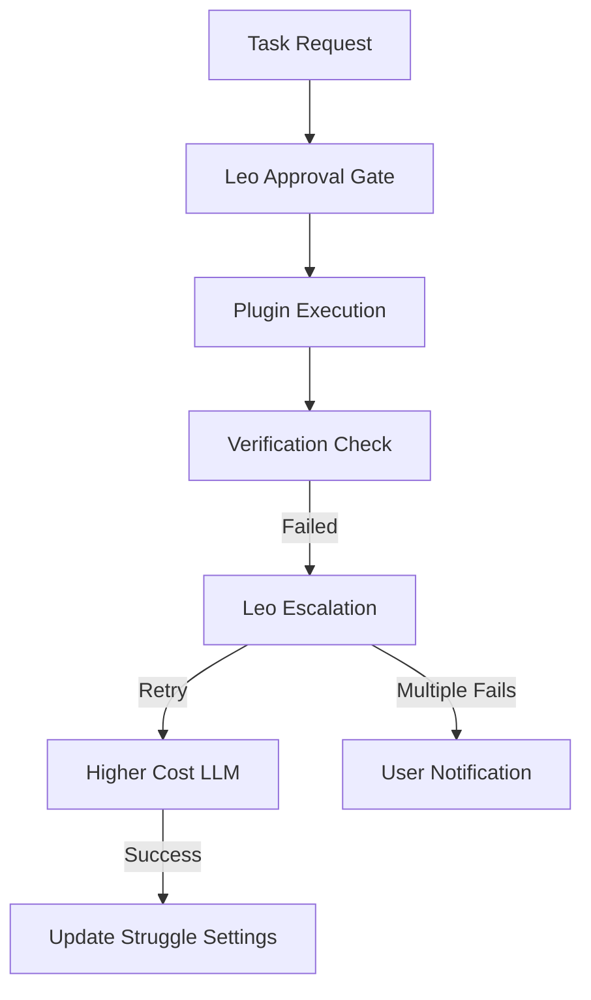

\# Claude Code ACAS Runner Implementation Guide

\#\# Core Principle: Reliable AI Coding That Doesn’t Stop Randomly

\*\*Anti-Bloat Priority:\*\* No analytics dashboards until we can save basic
data. Focus on verification, smart escalation, and learning from failures.

\-----

\#\# Phase 1: Foundation & Cleanup (Week 1\)

\#\#\# Step 1: Nuclear Analytics Cleanup

\*\*Objective:\*\* Remove all analytics bloat to establish lean foundation

\#\#\#\# Task 1.1: Delete Analytics Infrastructure

\`\`\`bash  
\# Remove these directories completely  
rm \-rf src/services/analytics/  
rm \-rf src/app/api/analytics/  
\`\`\`

\*\*Files to clean:\*\*

\- Remove all \`import\` statements referencing deleted analytics  
\- Clean \`src/services/llm-providers/provider-manager.ts\` \- remove mock
responses  
\- Clean \`src/services/escalation-manager.ts\` \- remove mock data generators  
\- Clean \`src/ai/flows/\` \- remove placeholder responses, keep core logic only

\#\#\#\# Task 1.2: Plugin Registry Streamline

\*\*File:\*\* \`src/services/plugin-system/plugin-registry.ts\`

\- Remove example/demo plugins  
\- Keep only core plugin infrastructure  
\- Ensure only production-ready plugins can be loaded

\-----

\#\#\# Step 2: Firebase Integration (Do This First)

\*\*Objective:\*\* Set up data persistence with retention limits before anything
else

\#\#\#\# Task 2.1: Firebase Collections Setup

\`\`\`typescript  
// src/lib/firebase/collections.ts  
interface SessionDoc {  
 userId: string;  
 plugin: string;  
 model: string;  
 startTime: Timestamp;  
 endTime?: Timestamp;  
 taskCount: number;  
 status: 'active' | 'completed' | 'failed' | 'crashed';  
}

interface StruggleDoc {  
 userId: string;  
 plugin: string;  
 model: string;  
 issueType: string;  
 count: number;  
 autoDisabled: boolean;  
 lastOccurrence: Timestamp;  
 escalateThreshold: number;  
}

interface ChatHistoryDoc {  
 sessionId: string;  
 userId: string;  
 messages: any\[\];  
 createdAt: Timestamp;  
 retentionDays: number; // Default: 30  
}  
\`\`\`

\#\#\#\# Task 2.2: Auto-Deletion & Notifications

\*\*File:\*\* \`src/services/data-retention.ts\`

\`\`\`typescript  
// Run daily cleanup job  
// Notify users 3 days before deletion  
// Hard limit: 30 days for chat history  
// Session data: 90 days  
\`\`\`

\-----

\#\# Phase 2: Claude Code Core Plugin (Week 1-2)

\#\#\# Step 3: Task Completion Verification System

\*\*Objective:\*\* Actually verify tasks completed, escalate failures
intelligently

\#\#\#\# Task 3.1: Process Detection & Monitoring

\*\*File:\*\* \`src/plugins/claude-code/monitor.ts\`

\`\`\`typescript  
interface TaskVerification {  
 taskId: string;  
 stopReason: 'completed' | 'error' | 'api_failure' | 'timeout' | 'user_stop';  
 actuallyCompleted: boolean;  
 verificationMethod: 'file_check' | 'build_test' | 'manual_confirm';  
 expectedOutputs: string\[\];  
 actualOutputs: string\[\];  
 escalationPath: 'claude_message' | 'queue_retry' | 'user_notify';  
}

class ClaudeCodeMonitor {  
 // Detect running Claude Code processes  
 detectClaudeCodeProcess(): Promise\<ProcessInfo\[\]\> {  
 // Windows: Look for claude-dev.exe, VS Code with Claude extension  
 // WSL/Unix: ps aux | grep claude  
 // Return process IDs, working directories, active projects  
 }

// Monitor .claude/ directories for changes  
 setupFileWatchers(projectPaths: string\[\]): void {  
 // Watch .claude/chat_history, .claude/task_status  
 // Trigger verification when files change  
 // Feed into TaskVerification system  
 }

// Post-task verification  
 verifyTaskCompletion(task: TaskRequest): TaskVerification {  
 // Check if expected files exist  
 // Run basic build/syntax check if applicable  
 // Return pass/fail with specific reasons  
 }  
}  
\`\`\`

\#\#\#\# Task 3.2: Struggle Settings Anti-Bloat Filter

\*\*File:\*\* \`src/plugins/claude-code/struggle-settings.ts\`

\`\`\`typescript  
interface StruggleSettings {  
 plugin: 'claude-code';  
 model: string;  
 struggles: {  
 \[issueType: string\]: {  
 count: number;  
 autoIgnore: boolean;  
 escalateThreshold: number;  
 lastSeen: Date;  
 };  
 };  
 sessionTally: number;  
 lifetimeTally: number;  
}

class StruggleManager {  
 // Load user's struggle settings from Firebase  
 loadSettings(userId: string, plugin: string): Promise\<StruggleSettings\>

// Check if issue should be ignored  
 shouldIgnoreIssue(issueType: string): boolean

// Increment struggle counter, auto-disable if threshold met  
 recordStruggle(issueType: string): StruggleAction

// Export settings for sharing with other users  
 exportSettings(): string // JSON download  
}

// Example struggle types for Claude Code:  
// "dependency_import_fails", "typescript_strict_mode", "wsl_path_translation"  
// "api_timeout_error", "context_window_exceeded", "file_permission_error"  
\`\`\`

\-----

\#\#\# Step 4: Leo Escalation System

\*\*Objective:\*\* Leo controls all escalation decisions and auto-approvals

\#\#\#\# Task 4.1: Escalation Hierarchy

\*\*File:\*\* \`src/plugins/claude-code/escalation-handler.ts\`

\`\`\`typescript  
interface EscalationEvent {  
 eventId: string;  
 issueType: string;  
 severity: 'low' | 'medium' | 'critical';  
 context: {  
 errorMessage: string;  
 fileContext: string;  
 recentErrors: ActivityEvent\[\];  
 projectState: any;  
 };  
 suggestedAction: EscalationAction;  
}

class ClaudeCodeEscalationHandler {  
 // Leo decides whether to escalate  
 async shouldEscalate(event: ActivityEvent): Promise\<boolean\> {  
 // Consult struggle settings first  
 // Check: critical severity, repeated patterns (3x), multiple errors (5 in
60s)  
 // Return Leo's decision  
 }

// Extract normalized error pattern for deduplication  
 extractErrorPattern(event: ActivityEvent): string {  
 // Strip file paths, line numbers, timestamps  
 // Normalize for pattern matching  
 }

// Leo's escalation decision tree  
 async createEscalation(event: ActivityEvent): Promise\<EscalationResult\> {  
 // 1\. Plugin auto-retry (if configured)  
 // 2\. Escalate to higher-cost LLM (Claude Opus, GPT-4)  
 // 3\. Multiple failures → user notification  
 // 4\. Update struggle settings based on outcome  
 }

// Auto-approve simple retries, escalate complex issues  
 async leoApprovalGate(action: ProposedAction): Promise\<ApprovalResult\> {  
 // Leo can auto-approve: file edits, dependency installs, simple fixes  
 // Leo escalates: major refactors, breaking changes, security issues  
 }  
}  
\`\`\`

\-----

\#\# Phase 3: WSL Quality of Life (Week 2\)

\#\#\# Step 5: Claude Code WSL Enhancements

\*\*Objective:\*\* Make Claude Code actually usable on Windows/WSL

\#\#\#\# Task 5.1: Turbo Mode & Memory Optimization

\*\*File:\*\* \`src/plugins/claude-code/wsl-optimizer.ts\`

\`\`\`typescript  
class WSLOptimizer {  
 // Detect available system memory  
 detectSystemResources(): SystemInfo {  
 // Check available RAM, CPU cores  
 // WSL-specific optimizations  
 }

// Front-load Claude prompt with memory hints  
 generateTurboPrompt(): string {  
 // "System has 16GB available. Optimize for memory bandwidth..."  
 // "Use parallel processing for file operations..."  
 // "Prefer streaming over batch operations..."  
 }

// Auto-translate Windows paths to WSL paths  
 translatePath(windowsPath: string): string {  
 // d:/ai → /mnt/d/ai  
 // C:\\Users\\... → /mnt/c/Users/...  
 // Handle edge cases, UNC paths, etc.  
 }

// WSL-specific Claude Code integration  
 setupWSLIntegration(): void {  
 // Auto-detect WSL distro  
 // Configure optimal working directory  
 // Set up path translation service  
 }  
}  
\`\`\`

\#\#\#\# Task 5.2: Terminal Integration

\*\*File:\*\* \`src/components/terminal/wsl-terminal.tsx\`

\`\`\`typescript  
// Embed xterm.js terminal with Claude Code integration  
// Connection status indicator (green/red dot)  
// Auto-translation of paths in terminal output  
// Turbo button in terminal header  
// Basic commands: Clear, Home, Claude Project Detection  
\`\`\`

\-----

\#\# Phase 4: Drift Prevention & Automation (Week 3\)

\#\#\# Step 6: Dependency Drift Detection

\*\*Objective:\*\* Catch outdated/bad imports before they break everything

\#\#\#\# Task 6.1: Package.json Baseline System

\*\*File:\*\* \`src/plugins/claude-code/drift-detector.ts\`

\`\`\`typescript  
interface DriftDetection {  
 packageJsonBaseline: PackageJson;  
 badImportQueue: ImportViolation\[\];  
 newDependencies: string\[\];  
 escalationTriggers: {  
 badImports: 4; // Auto-pause after 4 bad imports  
 outdatedDeps: 3; // Flag 3+ outdated dependencies  
 missingDeps: 2; // Missing dependencies trigger  
 };  
}

class DriftDetector {  
 // Load package.json at session start  
 loadBaseline(projectPath: string): void

// Flag imports not in dependencies  
 checkImportViolation(importStatement: string): ImportViolation | null

// Queue violations, trigger auto-pause  
 processViolation(violation: ImportViolation): DriftAction

// Integration with npm outdated/audit  
 checkDependencyHealth(): HealthReport

// Auto-escalate to research docs for migration recommendations  
 researchDependencyFix(dependency: string): Promise\<FixRecommendation\>  
}  
\`\`\`

\#\#\#\# Task 6.2: Auto-Documentation Integration

\*\*File:\*\* \`src/plugins/claude-code/documentation.ts\`

\`\`\`typescript  
// Leo automatically documents new dependencies  
// Tags TODOs for package.json updates  
// Integration with existing documentation flows  
// Simple markdown generation, not complex analysis  
\`\`\`

\-----

\#\# Phase 5: Error Recovery & Context Preservation (Week 3-4)

\#\#\# Step 7: Crash Recovery System

\*\*Objective:\*\* Save context on any random stop, enable seamless restart

\#\#\#\# Task 7.1: Context Preservation

\*\*File:\*\* \`src/plugins/claude-code/crash-recovery.ts\`

\`\`\`typescript  
interface CrashContext {  
 sessionId: string;  
 timestamp: Date;  
 activeTask: TaskContext;  
 fileStates: FileSnapshot\[\];  
 conversationHistory: Message\[\];  
 errorDetails: ErrorInfo;  
 recoveryInstructions: string;  
}

class CrashRecoveryManager {  
 // Auto-save context every 30 seconds during active tasks  
 autoSaveContext(): void

// Detect crashes: memory dumps, process exits, API timeouts  
 detectCrash(event: SystemEvent): boolean

// Save full context \+ error reason  
 saveCrashContext(context: CrashContext): Promise\<void\>

// Restore session from crash  
 restoreFromCrash(sessionId: string): Promise\<RestoreResult\>

// Smart restart with preserved context  
 smartRestart(context: CrashContext): Promise\<void\>  
}  
\`\`\`

\-----

\#\# Phase 6: GitHub Integration & Automation (Week 4\)

\#\#\# Step 8: Git Automation Suite

\*\*File:\*\* \`src/plugins/claude-code/git-integration.ts\`

\`\`\`typescript  
class GitAutomation {  
 // Auto-commit with meaningful messages  
 autoCommit(changes: FileChange\[\]): Promise\<CommitResult\>

// Smart .gitignore updates  
 updateGitignore(newPatterns: string\[\]): void

// Documentation generation for commits  
 generateCommitDocs(changes: FileChange\[\]): string

// Repozip automation for snapshots  
 createRepoSnapshot(commitHash: string): Promise\<string\>

// Integration with existing repo tools  
 forkAndImprove(repoUrl: string, improvements: string\[\]):
Promise\<ForkResult\>  
}  
\`\`\`

\-----

\#\# Implementation Priority & Success Metrics

\#\#\# Week 1 Deliverables:

\- \[ \] Analytics bloat removed  
\- \[ \] Firebase collections with retention limits  
\- \[ \] Basic task verification working  
\- \[ \] Struggle settings filtering repeat issues

\#\#\# Week 2 Deliverables:

\- \[ \] Leo escalation system functional  
\- \[ \] WSL path translation working  
\- \[ \] Turbo mode memory optimization  
\- \[ \] Terminal integration basic functionality

\#\#\# Week 3 Deliverables:

\- \[ \] Drift detection catching bad imports  
\- \[ \] Auto-pause on violation thresholds  
\- \[ \] Crash recovery context preservation  
\- \[ \] Smart restart capability

\#\#\# Week 4 Deliverables:

\- \[ \] GitHub automation suite  
\- \[ \] Leo mobile notification escalation (future)  
\- \[ \] Full integration testing  
\- \[ \] User feedback integration

\#\#\# Success Metrics (Simple Counters Only):

\- Task completion verification accuracy \> 95%  
\- Struggle setting auto-fixes \> 80% of repeat issues  
\- Session recovery success rate \> 90%  
\- User escalations \< 5% of total tasks  
\- WSL path translation errors \< 1%

\-----

\#\# Critical Implementation Notes

\#\#\# Claude Code Specific Behaviors:

1\. \*\*Message Timing:\*\* Claude Code can send messages anytime, other plugins
wait for pause  
1\. \*\*WSL Focus:\*\* Optimize for Windows/WSL users first, native later  
1\. \*\*Leo Priority:\*\* All escalation decisions go through Leo, not direct to
user  
1\. \*\*Memory Management:\*\* Front-load prompts with system memory info in
turbo mode  
1\. \*\*Error Patterns:\*\* Learn from Claude Code specific failures (context
limits, API timeouts)

\#\#\# Anti-Bloat Enforcement:

\- ✅ \*\*Build:\*\* Simple counters, JSON configs, file-based verification,
direct Firebase  
\- ❌ \*\*Don’t Build:\*\* Heat maps, complex analytics, team dashboards,
multi-tenant architecture

\#\#\# File Structure Priority:

\`\`\`  
src/plugins/claude-code/  
├── monitor.ts \# Process detection & file watching  
├── escalation-handler.ts \# Leo escalation system  
├── struggle-settings.ts \# Anti-bloat filter  
├── wsl-optimizer.ts \# WSL quality of life  
├── drift-detector.ts \# Dependency management  
├── crash-recovery.ts \# Context preservation  
├── git-integration.ts \# GitHub automation  
└── index.ts \# Plugin entry point  
\`\`\`

\*\*The goal: Claude Code that reliably completes tasks, learns from failures,
and escalates intelligently. Everything else is bloat until this works.\*\*

# ACAS Runner Vision Sheet: AI Integration Reality Check

## Core Problem Statement

Current AI implementations are bloated with premature analytics and heat maps
when we can’t even save basic data. Need to focus on **reliability,
verification, and smart escalation** before fancy dashboards.

## Phase 1: Foundation (MVP Focus)

### 1. Task Completion Verification System

```typescript
interface TaskVerification {
  stopReason: 'completed' | 'error' | 'api_failure' | 'timeout' | 'user_stop';
  actuallyCompleted: boolean;
  verificationMethod: 'file_check' | 'build_test' | 'manual_confirm';
  escalationPath: 'claude_message' | 'queue_retry' | 'user_notify';
}
```

**Implementation:**

- Post-task file system scan to verify expected outputs exist
- Simple build/syntax check where applicable
- Auto-escalate failed verifications to Claude (immediate) vs other plugins
  (queued)
- **No complex analytics** - just pass/fail tracking

### 2. Struggle Settings (Anti-Bloat Filter)

```json
{
  "plugin": "claude-code",
  "model": "claude-3-5-sonnet",
  "struggles": {
    "dependency_import_fails": { "count": 4, "auto_ignore": true },
    "typescript_strict_mode": { "count": 1, "escalate_threshold": 2 },
    "wsl_path_translation": { "disabled": true }
  },
  "session_tally": 23,
  "lifetime_tally": 156
}
```

**Features:**

- JSON-based customizable filters per plugin/model
- Simple counters: session + lifetime tallies only
- User-downloadable struggle configs to share solutions
- Auto-disable problematic checks that fire repeatedly

### 3. Firebase/Firestore Integration (Do This First)

```typescript
// Basic collections - no fancy analytics yet
collections: {
  sessions: { user, plugin, model, start_time, end_time, task_count }
  struggles: { plugin, model, issue_type, auto_disabled, user_action }
  chat_history: { session_id, messages[], retention_days: 30 }
}
```

**Critical:**

- Set retention limits immediately (30 days default)
- Auto-notify users before deletion
- Simple session persistence for error recovery

## Phase 2: Quality of Life

### 4. Claude Code WSL Turbo Mode

```bash
# Auto-detect available system memory
AVAILABLE_RAM=$(free -m | awk 'NR==2{printf "%.0f", $7/1024}')
TURBO_PROMPT="System has ${AVAILABLE_RAM}GB available. Optimize for memory bandwidth..."

# Path translation service
/mnt/d/ai ← d:/ai (auto-detect and translate)
```

**Features:**

- Memory-aware prompt enhancement
- Automatic Windows → WSL path translation
- “Turbo” button that front-loads optimization hints

### 5. Drift Prevention System

```typescript
interface DriftChecker {
  packageJsonBaseline: PackageJson;
  badImportQueue: ImportViolation[];
  escalationTriggers: {
    bad_imports: 4;
    outdated_deps: 3;
    missing_deps: 2;
  };
}
```

**Auto-detection:**

- Load package.json at session start as baseline
- Flag imports not in dependencies
- Queue violations → auto-pause after threshold
- Tag new deps for Leo documentation review

## Phase 3: Automation & Integration

### 6. Error Recovery & Context Preservation

- Crash detection → save current context + error to Firebase
- Auto-restart with preserved context
- Memory dump analysis for random stops

### 7. Dependency Management

- End-of-task dependency scan
- Integration with npm outdated/audit
- Auto-escalation to research docs for recommended migrations
- Fork existing package.json updater tools

### 8. GitHub Integration Suite

- Auto-commit with meaningful messages
- Documentation generation integration
- Smart .gitignore updates
- Repozip automation for commit snapshots

## Phase 4: Leo Central Command

### 9. Leo as System Controller



**Escalation Hierarchy:**

1. Plugin auto-retry (free)
1. Leo escalation to higher-cost LLM
1. Multiple failures → user notification (future: mobile)
1. Leo learns and updates struggle settings

## Anti-Bloat Principles

✅ **Build This:**

- Simple counters, not complex analytics
- JSON configs, not databases for settings
- File-based verification, not elaborate testing frameworks
- Direct Firebase integration, not abstraction layers

❌ **Don’t Build (Yet):**

- Heat maps and visualizations
- Team analytics and dashboards
- Complex workflow orchestration
- Multi-tenant architecture

## Implementation Priority Queue

1. **Week 1:** Firebase setup + basic task verification
1. **Week 2:** Struggle settings + Claude Code WSL improvements
1. **Week 3:** Drift prevention + error recovery
1. **Week 4:** Leo escalation system integration
1. **Future:** GitHub automation + dependency management

## Success Metrics (Simple)

- Task completion verification accuracy > 95%
- Struggle setting auto-fixes > 80% of repeat issues
- Session recovery success rate > 90%
- User escalations < 5% of total tasks

**The goal: Reliable AI coding that doesn’t stop randomly, learns from failures,
and escalates intelligently. Analytics can wait until we have something worth
measuring.**
